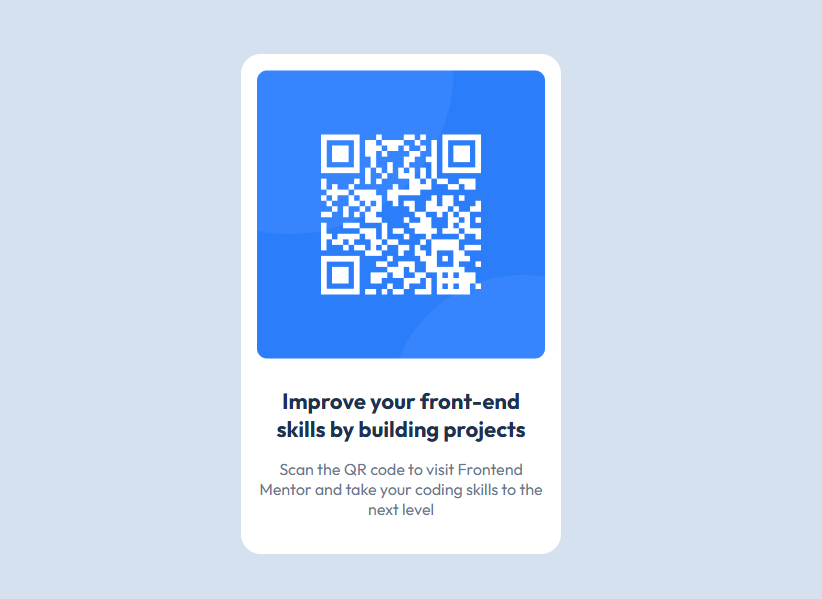
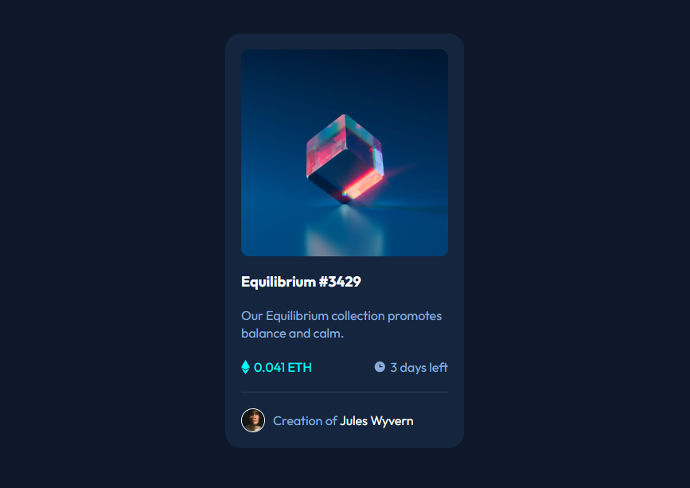

# Repositório de Projetos Newbie - Frontend Mentor

Bem-vindo(a) a este repositório! Aqui você encontrará todos os meus projetos na categoria *newbie* do site [Frontend Mentor](https://www.frontendmentor.io/), desenvolvidos utilizando HTML e CSS.  

Estou criando estes projetos como parte do meu aprendizado, e também para compartilhar o código com quem precisar de inspiração ou estiver com dúvidas sobre algum desafio.

Sinta-se à vontade para explorar, sugerir melhorias ou deixar um feedback. 🚀

## Projetos
- [Blog Preview Card](#blog-preview-card)
- [QR Code Component](#qr-code-component)
- [NFT Preview Card Component](#nft-preview-card-component)

## Blog Preview Card 

- [Clique aqui para ver o site](https://blog-preview-card-esther.netlify.app/)

## QR Code Component 

- [Clique aqui para ver o site](https://qr-code-component-esther.netlify.app/)

## NFT Preview Card Component 

- [Clique aqui para ver o site](https://nft-preview-card-component-esther.netlify.app/)

## Autor
<a href="https://www.instagram.com/_esther_cardoso/">
 
  
</a>

Feito por Esther Cardoso 👋🏽 Entre em contato!

